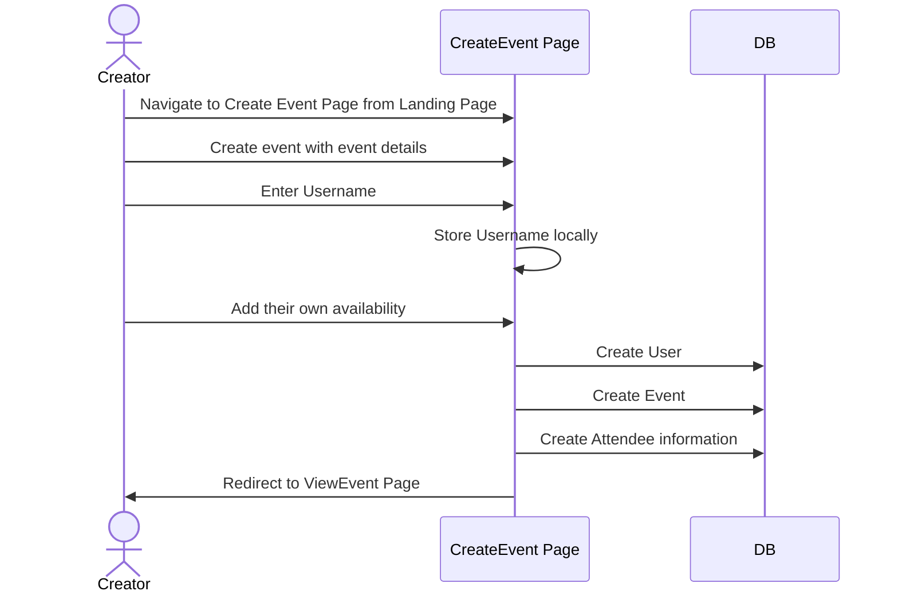
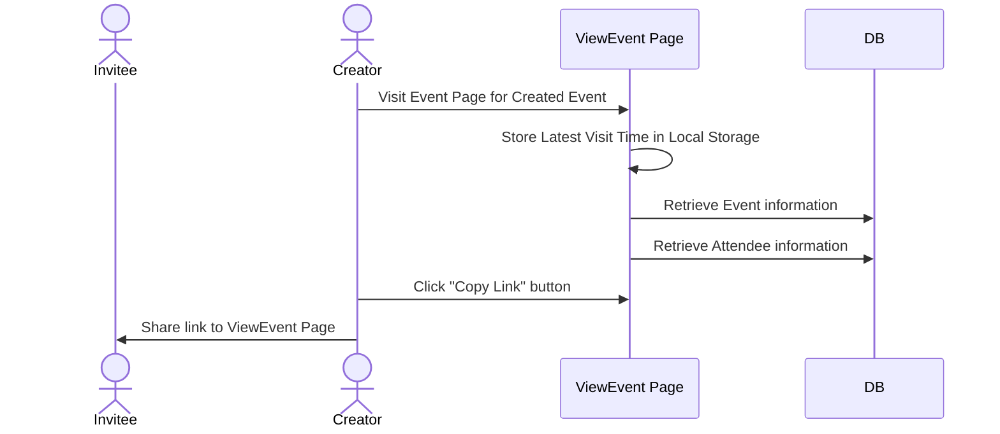
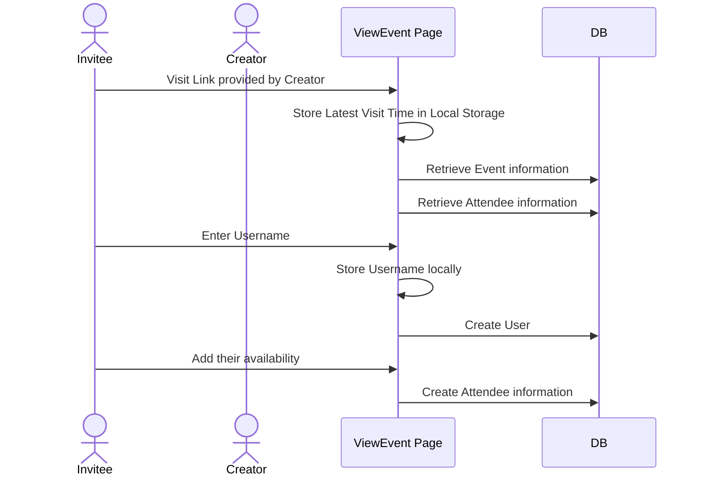
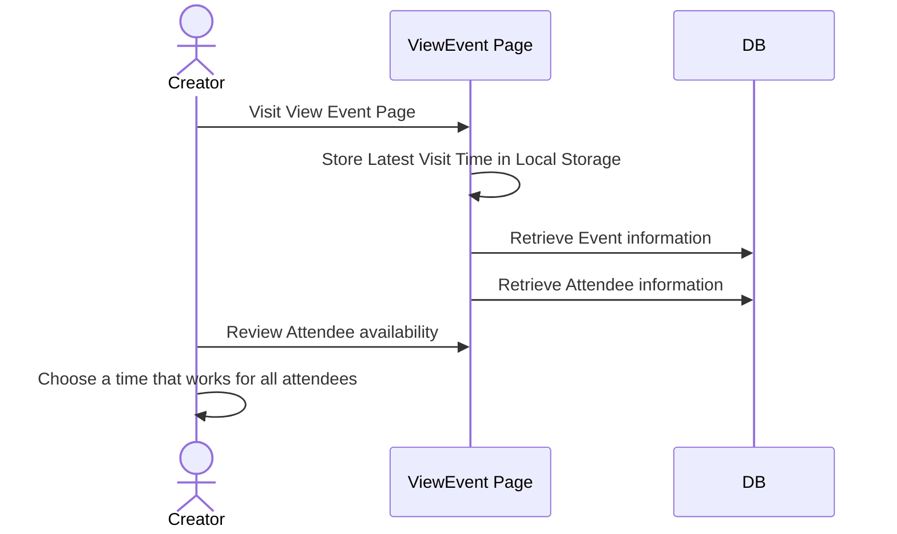
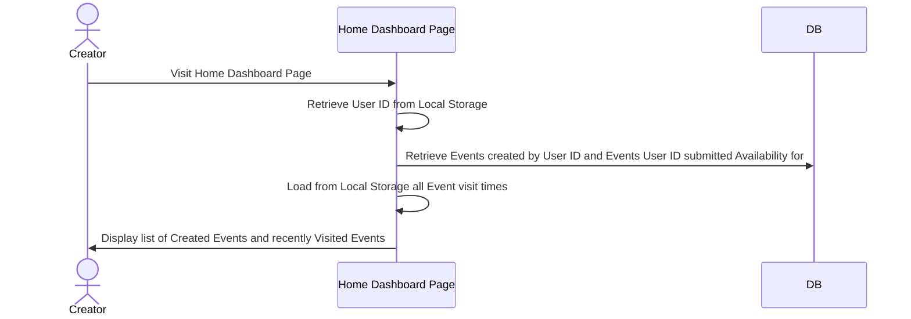

# Architecture

This document describes the high-level architecture of the FindingATime web application.
If you want to familiarize yourself with the code base, you are in the right place!

## Constraints

The current webapp is built under the design philosophy of lowest friction. There are no login requirements requiring sign up.
Instead UUIDs are generated per browser user and store in local storage and in the remote database to create events and to add availability by invitees to those events.

## Bird's Eye View

Users of Finding A Time have a general flow the site supports today:

- event creators come to the site and use the create-event page to fill out event details and their availability



- they are provided with a link to the event they can distribute via any medium that allows for others to add their availability



- invitees that visit the link are taken to the view-event page where they may add their own availability



- creators can revist the view event page to gather availability for all invitees



- event creators and invitees who visit the home dashboard page can see events they have created



## Tech Stack

- ⚡️ Next.js 14 (App Router)
- 💚 Supabase w/ supabase-ssr - Works across the entire [Next.js](https://nextjs.org) stack (App Router, Pages Router, Client, Server, Middleware, It just works!)
- ⚛️ React 18
- 🌼 [Daisy UI](https://daisyui.com/) - The most popular component library for Tailwind CSS
- ⛑ [TypeScript] (https://www.typescriptlang.org/) - JavaScript with syntax for types
- 📦 [pnpm](https://pnpm.io/) - Fast, disk space efficient package manager
- 🎨 [Tailwind](https://tailwindcss.com/)
- 🔌 [shadcn/ui](https://ui.shadcn.com/) - Beautifully designed components that you can copy and paste into your apps.
- 🧪 Jest w/SWC + React Testing Library - Unit tests for all of your code.
- 🎛️ [MSW](https://mswjs.io/)v2 - Intercept requests inside your tests (set up for testing only)
- 🪝[TanStackQuery](https://tanstack.com/query/v5)v5 - The best way to fetch data on the client
- 📏 ESLint — To find and fix problems in your code
- 💖 Prettier — Code Formatter for consistent style
- 🐶 Husky — For running scripts before committing
- 🚫 lint-staged — Run ESLint and Prettier against staged Git files
- 👷 Github Actions — Run Type Checks, Tests, and Linters on Pull Requests
- 🗂 Path Mapping — Import components or images using the `@` prefix
- ✨ Next Top Loader - Render a pleasent top loader on navigation with [nextjs-toploader](https://github.com/TheSGJ/nextjs-toploader)
- 🔋 Lots Extras - Next Bundle Analyzer, Vercel Analytics, Vercel Geist Font

## Code Map

This section talks briefly about various important directories and data structures.

```
src
├── app
│   ├── api                     # API calls that interact with Supabase
│   ├── create-event            # Page for creating new events
│   ├── home                    # Home dashboard view
│   └── page.tsx                # Landing page
├── components                  # React components core to the website like (Header.tsx, EventCard.tsx, etc)
├── utils                       # Common utils used by components and api's for data structure manipulation
├── tailwind.config.js          # Configure tailwind CSS and DaisyUI
└── .env.example                # Configuration file for setting up local build
```

### Supabase

Database migrations can be found in this [folder](supabase/migrations/). You can find the schema definition for core tables like `Users`, `Events` and `Attendees` there.

The `seed.sql` file that seeds the database post `supabase db reset` can be found here [folder](supabase/seed.sql).

### Local Tools

Husky is called via precommit hooks and can be found [here](.husky/pre-commit) with the bulk of validation in this [shell file](.husky/_/husky.sh)

### GitHub CI

GitHub Actions are used for validating PRs for readiness to merge into `main` and can be found [here](.github/workflows/pull-request.yaml)

## Deployment

The findingatime.com website is deployed to CloudFlare Pages linked to a Supabase.com project.
The following configurations were used for deployments on CloudFlare:

```
Build command: npx @cloudflare/next-on-pages@1
Build output directory: /.vercel/output/static
Root directory: /
Build comments on pull requests: Enabled
```

The following environment variables were set for each deployment environment:

```
HOST_URL = findingatime.com
NEXT_PUBLIC_SUPABASE_ANON_KEY = <your supabase anon key>
NEXT_PUBLIC_SUPABASE_URL = <your supabase app url>
NODE_VERSION = 19.3.0
```
